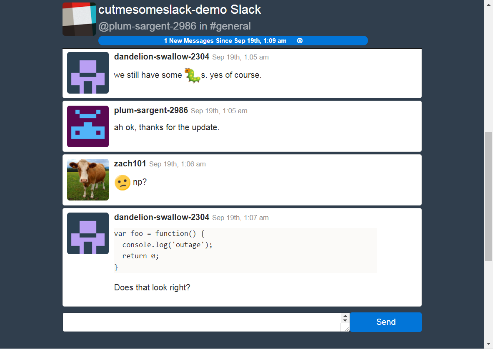

# Cut Me Some Slack!
> Anonymous Slack web portal. Read and write messages, help-desk style.
[Chat on the Demo App!](https://cutmesomeslack-demo.herokuapp.com/)



## Why?

Slack is convenient and easy to use, yet people don't always want to log in!
Simply present them with a link to your website and slack channel via this app, and _presto_, they can be chatting
with you in seconds!

## Creating a Slack Access Token

In order for this application to work, we will need a Slack API Oauth Access token.
To do this, I recommend creating a private slack app, authorizing it with special scopes, and using the returned access token.

Here are the steps:

1) Visit the [new app page](https://api.slack.com/apps)
2) Enter an app name (eg: _cut-me-some-slack_), select the workspace you wish to connect to, then click 'create app.'
3) note the 'Client ID' (`CLIENT_ID`) and 'Client Secret' (`CLIENT_SECRET`) fields. We will use these later (save for now).
4) On the app page, click 'add features and functionality', then 'permissions.' Add a redirect url (`CALLBACK_URL`) of the form `http://localhost:3000/callback` then click 'Save URLs.'
5) In your browser (or with `curl`) make a request of the following form (substituting your `CLIENT_ID` and `CALLBACK_URL`):
   `https://slack.com/oauth/authorize?client_id=CLIENT_ID&scope=client+admin&redirect_uri=CALLBACK_URL`
6) Authorize the app. You will be redirected to the callback of the form
  `http://localhost:3000/callback?code=CODE&state=`
  Save the value of `CODE` for the next step.
7) Using your `CODE`, `CALLBACK_URL`, `CLIENT_ID`, and `CLIENT_SECRET`, make a `POST` request to complete the Oauth flow and install the client in your workspace:
  `curl -XPOST 'https://slack.com/api/oauth.access?client_id=CLIENT_ID&client_secret=CLIENT_SECRET&code=CODE&redirect_uri=CALLBACK_URL'`

  This should output a piece of JSON in the form:
  `{"ok":true,"access_token":"xoxp-...","scope":"read,client,admin,identify,post","team_name":"cutmesomeslack-demo", ...}`
  Save the `access_token` value - this is your `SLACK_TOKEN` to be used further down for configuration.

## Deploying to Heroku

```
$ heroku create my-slack-app
$ heroku config:set SLACK_TOKEN=xoxp-... # slack token with correct scopes, as created above
$ heroku config:set HEROKU_APP_DOMAIN=my-slack-app.herokuapp.com # domain for websockets
$ heroku config:set REACT_APP_SLACK_CHANNEL=general # default channel to display
$ heroku config:set JWT_SECRET=$(uuidgen) # for user identity auth
$ heroku buildpacks:set heroku/go
$ heroku buildpacks:add heroku/nodejs
$ git push heroku master # deploy
```

## Developing

Pull requests welcome!

To start the React development server:

```
$ yarn install
$ # Optionally, export REACT_APP_SLACK_CHANNEL=api-testing
$ # Optionally, export REACT_APP_BACKEND_URI=ws://otherhost:otherport/stream
$ PORT=3001 yarn start
```

For development of the backend, a `.env` file is supported with `KEY=VALUE` pairs.

To start the Golang backend:

```
$ PORT=3000 go run cmd/cut-me-some-slack/main.go
```

Then visit http://localhost:3001 for the development, hot-reloading,
React frontend or http://localhost:3000 for the production build (once
`yarn build` has been run).

## TODO

* auth0 support
* channel config (disallow, allow)
* more channel info (users, typing, etc)
* message update / delete visualization
* reactions
* better edit pane (autocomplete, @mentions, #mentions)
* threads
* bot message ui
* attachment viewing
* direct messages
* ...
